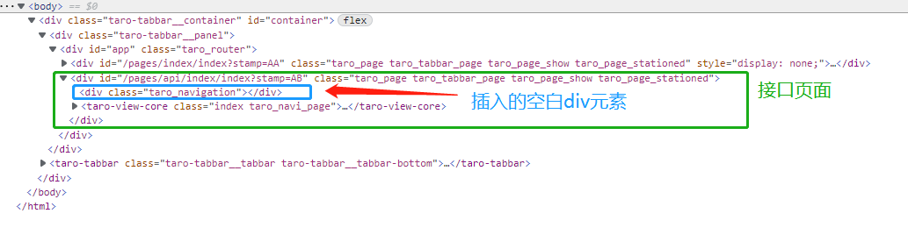
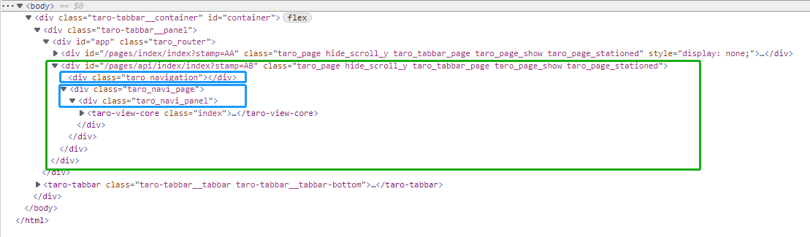

## 导航栏
### 设计
自定义NavigationBar组件，与TaroWeb组件层叠`Stack`布局，并且应用全屏显示。源码片段如下所示：
```extendtypescript
Stack({ alignContent: Alignment.TopEnd }) {
  TaroWeb({
    src: this.currentUrl,
    currentUrl: this.currentUrl,
    apiAdapter: this.adapter,
    useBuildIn: this.useBuildIn,
    entryDomain: this.entryDomain,
    taroWebController: this.taroWebController,
    onTitleReceive: this.onTitleReceive,
    onRefreshAccessedHistory: this.onRefreshAccessedHistory
  })
  NavigationBar({
    navigationBarData: this.navigationBarData,
    onBackPressed: this.onNavigationBarBackPressed
  })
}
```
不采用Column布局的主要原因是Column布局情况下，当导航栏从显示变成隐藏，Web组件的高度将变化，内容元素高度重新计算导致页面有跳动的现象。

### 问题与目标
Stack布局情况下，导航栏会叠加在Web上面，以下几个问题需要注意：
- 1 当有导航栏时，Web里面的内容需要空出导航栏高度
- 2 有导航栏页面向无导航栏页面跳转时，页面内容不能跳动闪烁
- 3 元素的position: fixed定位需要正常
- 4 enablePullDownRefresh: true的页面内容，需要滚动正常

#### 方案一：解决上述1，2，4的问题，但问题3未解决
在页面加载时，如果该页面需要显示导航栏，则在页面中插入一个子元素`<div class="taro_navigation"></div>`，这样原有的页面内容整体下移。

原有
```
      taro_page
          |
    taro-view-core
```
变成
```
                taro_page
                    |
                 /     \
    taro_navigation   taro-view-core
```

下图展示了插入元素后的DOM结构：



对应的源码实现如下：
```typescript
// packages\taro-mpharmony\src\api\index.ts
export default class PageHandler {
  // ...
  isDefaultNavigationStyle () {
    let style = this.config.window?.navigationStyle
    if (typeof this.pageConfig?.navigationStyle === 'string') {
      style = this.pageConfig.navigationStyle
    }
    return style !== 'custom'
  }

  addBlankNavigationBar (pageEl: HTMLElement | null) {
    if (this.isDefaultNavigationStyle() && pageEl && !pageEl.querySelector('.taro_navigation')) {
      const firstChild = pageEl.firstElementChild
      if (firstChild) {
        const navigation = document.createElement('div')
        navigation.classList.add('taro_navigation')
        firstChild.classList.add('taro_navi_page')
        pageEl.insertBefore(navigation, firstChild)
      }
    }
  }

  load (page: PageInstance, pageConfig: Route = {}, stampId: string, pageNo = 0) {
    if (!page) return
    // ...
    if (pageEl) {
      setDisplay(pageEl)
      this.addBlankNavigationBar(pageEl)
      // ...
    } else {
      page.onLoad?.(param, () => {
        pageEl = this.getPageContainer(page)
        this.addBlankNavigationBar(pageEl)
        // ...
      })
    }
  }
}
```
对应的css配置如下：
```css
.taro_navigation {
  display: block;
  width: 100%;
  height: 79px;
}

.taro_navi_page {
  transform: translateZ(0);
}
```
**这种实现下存在的问题： 页面内元素的position:fixed定位失效。可以参考`mini-program-example`样例，进入 `接口`-- `画布`页面，其中的canvas元素使用了position:fixed定位，但不生效。**

#### 方案二：解决上述1，2，3的问题，但问题4未解决
在页面加载时，如果该页面需要显示导航栏，则把页面的唯一子元素移到一个新创建的元素：

原有
```
      taro_page
          |
    taro-view-core
```
变成
```
            taro_page  （去掉页面y方向滚动属性）
                |
            /      \
 taro_navigation    taro_navi_page （增加transform属性，让position:fixed元素相对该元素定位）
                          |
                    taro_navi_panel （增加页面y方向滚动）
                          |
                    taro-view-core
```
下图展示页面的DOM结构：



对应的源码修改如下：
    
```typescript
addBlankNavigationBar(pageEl: HTMLElement | null) {
  if (this.isDefaultNavigationStyle() && pageEl && !pageEl.querySelector('.taro_navigation')) {
    const firstChild = pageEl.firstElementChild
    if (firstChild) {
      const naviPage = document.createElement('div')
      naviPage.classList.add('taro_navi_page')
      const navigation = document.createElement('div')
      navigation.classList.add('taro_navigation')
      const naviPanel = document.createElement('div')
      naviPanel.classList.add('taro_navi_panel')
      pageEl.classList.add('hide_scroll_y')
      naviPanel.appendChild(pageEl.removeChild(firstChild))
      naviPage.appendChild(naviPanel)
      pageEl.appendChild(navigation)
      pageEl.appendChild(naviPage)
    }
  }
}
```
对应的css配置如下：
```css
.taro_navigation {
  display: block;
  width: 100%;
  height: 79px;
}

.hide_scroll_y.taro_page {
    overflow-y: hidden;
}

.taro_navi_panel {
    width: 100%;
    overflow-x: hidden;
    overflow-y: scroll;
}

.taro-tabbar__container .taro_page.taro_tabbar_page .taro_navi_panel {
    max-height: calc(100vh-50px-79px);
}

.taro-tabbar__container .taro_page .taro_navi_panel {
   max-height: calc(100vh-79px);
}

.taro_navi_page {
  transform: translateZ(0);
}
```
**这种实现下存在的问题： enablePullDownRefresh: true的页面内容滚动异常。原因是改变了元素的父子关系，pull-down-refresh组件在初始化的时候使用了父元素taro_page。经过插入新元素这种父子关系被破坏**
